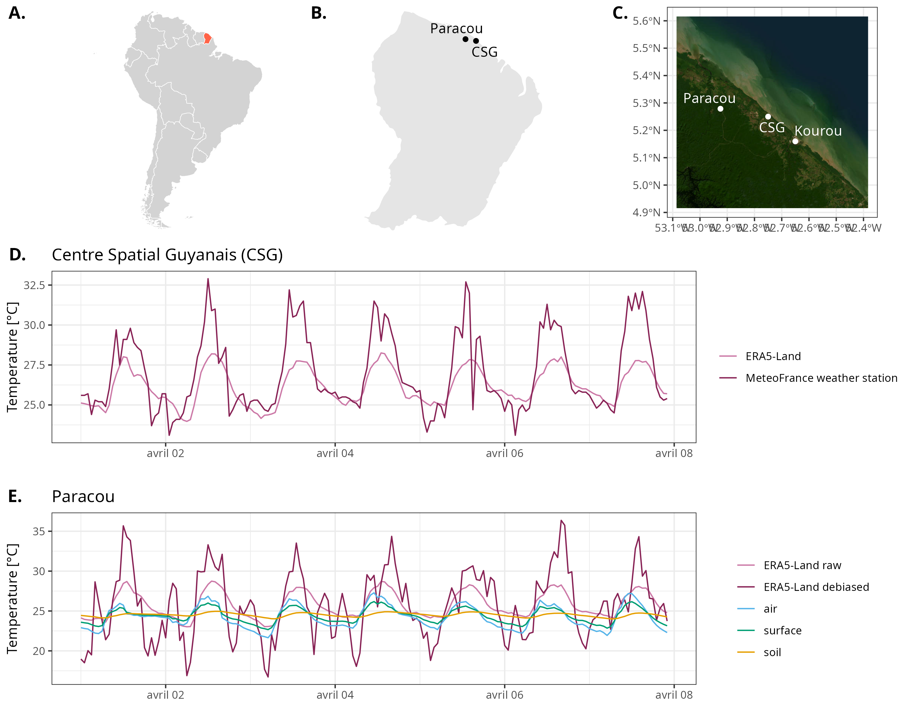
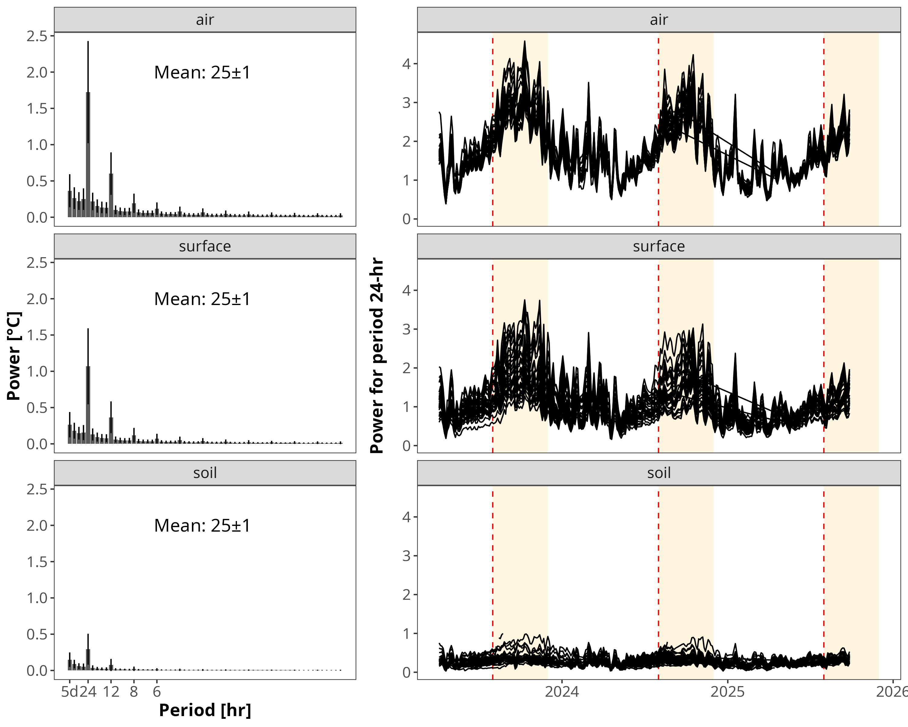
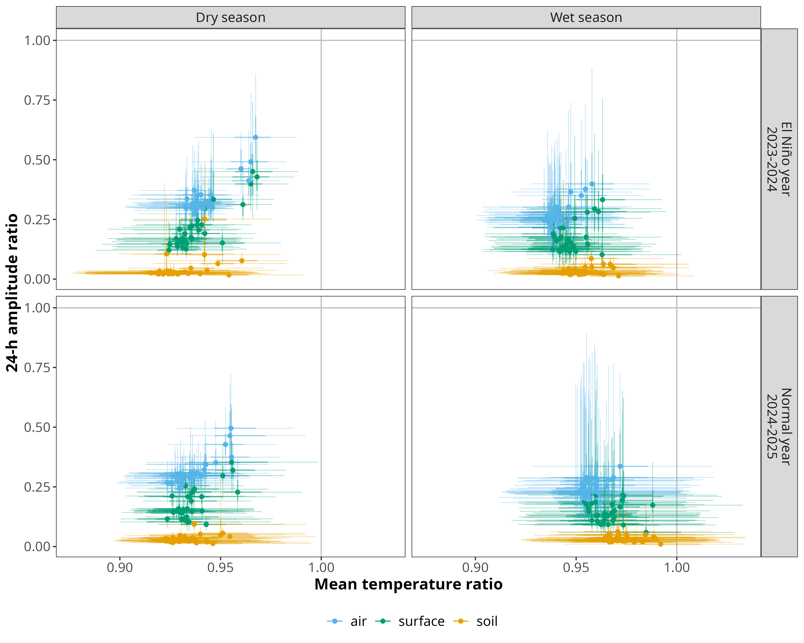
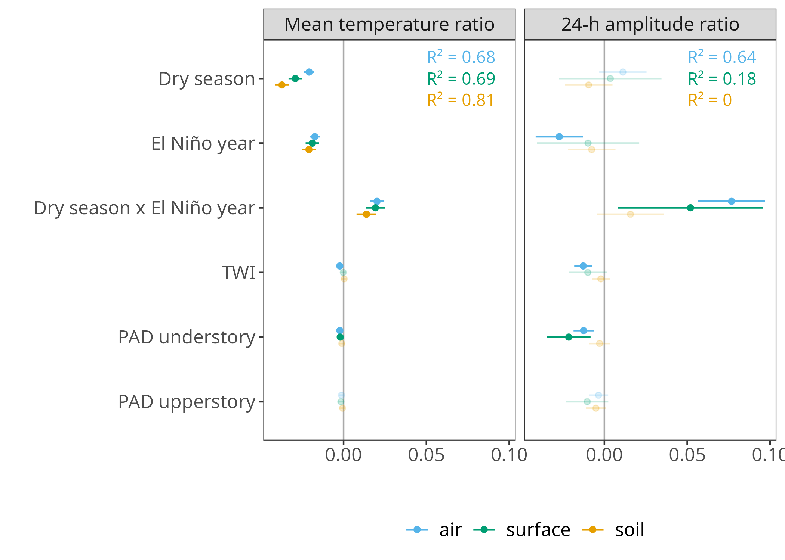
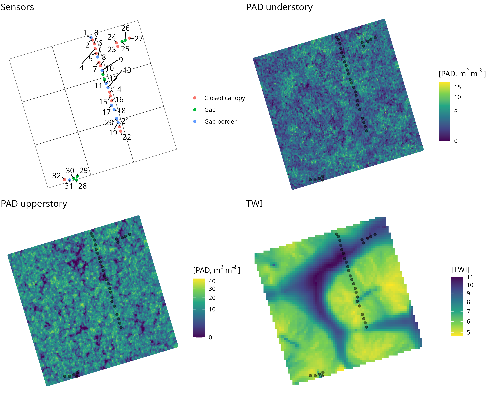
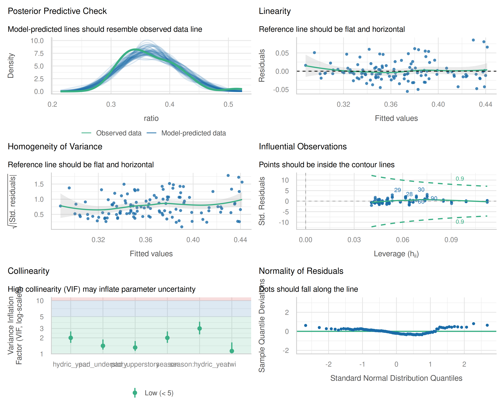

**Aim**: *Global Change Biology*

**Cover letter**:

**All analyses**: <https://sylvainschmitt.github.io/microclimalt/> 

## Affiliations

1 - CIRAD, UPR Forêts et Sociétés, F-34398 Montpellier, France\
2 - Forêts et Sociétés, Univ Montpellier, CIRAD, Montpellier, France\
3 - UMR CNRS 7352 "Laboratoire Amiénois de Mathématique Fondamentale et Appliquée" (LAMFA), Université de Picardie Jules Verne, 33 rue St-Leu, 80000 Amiens, France\
4 - AMAP, ADEME\
5 - ECOFOG\
6 - CRBE, CNRS\
7 - UMR CNRS 7058 “Ecologie et Dynamique des Systèmes Anthropisés” (EDYSAN), Université de Picardie Jules Verne, 1 rue des Louvels, 80000 Amiens, France

## Abstract

*Abstract.*

### Keywords

*Keywords.*

## Introduction

Introduction.

## **Material and methods**

### **Study site and data**

*Paracou ALT plot - **Giaco**, **Géraldine** & **Jérôme***

9-ha plot within plot 16 of the Paracou research station (French Guiana, South America, @fig-mm) with all trees \>1-cm DBH mapped and identified to the species level (actually the inventory is not very relevant for this work).

*Microclimate Tomst sensors - **Vincyane** & **Léa***

32 Tomst TMS-4's sensors were spaced 10 m apart, with a minimum distance of 1 m from the HOBO® sensors to avoid ground disturbance caused by the HOBO stakes. Tomst sensors measured air (x-cm), surface (x-cm) and soil (-x-cm) temperatures. Acquisition began on 1 May 2023. with a temporal resolution of 15 minutes and protection against direct light and rain (although they still overheated in the sunshine). The sensors were located across transects that covered topographical gradients and forest canopy openness [@fig-fs1]. Data were retrieved until 30 September 2025 [@fig-spectrum].

*Macroclimate ERA5-Land reanalysis - **Sylvain***

We retrieved macroclimatic data from ERA5-Land [@muñoz-sabater2021] at both Paracou and at the nearest MétéoFrance weather station from Kourou space center (CSG, @fig-mm). We also retrieved the public data from the CSG MétéoFrance weather station [@meteofrance2026].

*PAD understory, upperstory and TWI from lidar - **Vincyane** & **Greg***

We used high penetration lidar [@badouard2025] to compute Plant Area Density (PAD) derived from 1m3 voxels using AMAPVox [@AMAPVox] and Topographic Wetness Index (TWI) at a 5m pixel resolution. We interpolated for each microclimate sensor the PAD column with a 3m buffer and the corresponding TWI values [@fig-fs1]. We further aggregated PAD values and in the sum of the understory vegetation below 10-m and upperstory above 10-m.

```{r mm}
#| label: fig-mm
#| message: false
#| warning: false
#| echo: false
#| fig-width: 10
#| fig-height: 8
#| fig-cap: "Study sites and temperature time series in French Guiana. (A) Location of French Guiana within South America. (B) Location of the two study sites, Paracou and Centre Spatial Guyanais (CSG), in the Kourou region of French Guiana. (C) Satellite view of the study area showing Paracou, CSG, and Kourou. (D) Comparison of air temperature at CSG from ERA5-Land reanalysis and an in-situ MeteoFrance weather station over one week (April 1–8), showing that ERA5-Land captures the diurnal cycle but underestimates daily temperature maxima. (E) Comparison of bias-corrected ERA5-Land air temperature ('ERA5-Land debiased') with microclimate measurements at Paracou (air, surface, and soil temperature) over the same period, illustrating the buffering effect of the forest canopy and soil on temperature extremes relative to the free-air reanalysis estimate."

```

### **Discrete Fourier Transform and statistical analyses**

*Macroclimate debiasing - **Sylvain***

We debiased ERA5-Land macroclimate data using the relationship between the Fourier coefficients after decomposition of ERA5-Land and the CSG weather station (ref to article in prep). We used the full time series for the Fourier transform, since missing data could not be accommodated. We focused on the microclimate study years 2023–2025. The weather station data were missing only nine measurements across six days, so we filled these using local linear interpolation, yielding 365 and 366 days (2024 being a leap year), each at 24-hour resolution. This produced a large two-year power spectrum, with most power concentrated at periods of 0, 24, and 12 hours and their harmonics, as well as between periods of two years and one day. The power ratio between ERA and the weather station showed that ERA power decreased relative to observed power as frequency increased, consistent with a reanalysis smoothing small-scale temporal variations. However, even at low frequencies and periods longer than 24 hours, weather station power remained higher than ERA5-Land power. We used this ratio, computed for the Kourou CSG station, to interpolate the debiased ERA5-Land data back to the Paracou station for 2023–2024.

*Microclimate buffer computation - **Sylvain***

We decomposed the temperature series for both the debiased macroclimate of ERA5-Land reanalysis in Paracou and the temperature series from Tomst microclimate sensors, which recorded either air, surface or soil temperatures. We used Fourier transform decomposition with a sliding window of five days and a shift of three days, analysing only complete data series. Based on this decomposition, we created power spectra for air temperatures, which highlight the power of temperature variation (°C) per period or frequency (here, period in hours; see[ ](https://sylvainschmitt.github.io/fourier/#fig-proj)ref article in prep for explanation). We then computed the microclimate buffers as the ratio of mean temperature and power for the 24-hour period for the Tomst microclimate sensors, compared to debiased macroclimate of ERA5-Land reanalysis. 

*Spatio-temporal GLM - **Sylvain***

To assess the drivers of microclimate buffering, we modelled the buffer ratios (temperature and power, see above) as a function of seasonal, interannual and structural forest covariates. For each combination of variable (mean temperature or 24-hour power ratio) and sensor type (air, surface, soil), we fitted a separate linear model, with the buffer ratio as the response variable: 

Ratio \~ Season × Hydric year + TWI + PAD understory + PAD upperstory

Season was coded as a two-level factor (wet, dry), and hydric year was recorded from the onset of dry-season (1st of August) across calendar-year pairs into a two-level factor contrasting a normal rainfall year (2024–2025) against an El Niño-affected year (2023–2024, "normal" set as the reference level). The interaction between season and hydric year allowed the effect of season on the buffer ratio to differ depending on the prevailing hydrological regime. Topographic Wetness Index (TWI) and Plant Area Density, separated into understory (\<10 m) and upperstory (\>10 m) components, were included as continuous covariates and standardised (zero mean, unit variance) prior to fitting, so that their coefficients are directly comparable in magnitude. Models were fitted independently for each period (temperature vs. 24-h power) and each sensor type (air, surface, soil).

## Results

*Results*.

[@fig-spectrum]: Daily power is amplified during the dry season for air and surface temperatures, particularly during the 2023–2024 dry season (El Niño year), whereas the soil signal remains comparatively stable and of low amplitude throughout the study period.

```{r spectrum}
#| label: fig-spectrum
#| message: false
#| warning: false
#| echo: false
#| fig-width: 10
#| fig-height: 8
#| fig-cap: "Mean power spectrum decomposition and temporal dynamics of the 24-hour power peak. (Left) Mean power spectra (°C) as a function of period (in hours, decreasing from 5 days to a few hours) for air, surface, and soil Tomst sensors, obtained through Fourier decomposition using a 5-day sliding window (3-day shift) over the full acquisition period (May 2023–September 2025). All three panels show power strongly concentrated around the 24-hour period (diurnal cycle) and its 12-hour harmonic, with power decreasing at shorter periods; the intensity of the diurnal peak declines markedly from air to surface to soil, reflecting the progressive damping of the thermal signal with depth. The mean temperature (± SD) over the full period is indicated in each panel (25 ± 1°C for all three compartments). (Right) Time series of power at the 24-hour period, extracted for each sliding window and for each of the 32 sensors (one line per sensor), shown separately for air, surface, and soil from 2023 to 2026. Shaded orange bands indicate dry seasons, and vertical dashed red lines mark the start of each dry season (or hydric year) considered in the analyses."

```

[@fig-buffer]: Across all panels, both mean temperature and 24-hour amplitude ratios remain below 1, indicating a general buffering effect of the forest microclimate relative to the macroclimate. This buffering is strongest and most consistent for soil, intermediate for surface, and weakest for air, and it is more pronounced in the dry season than in the wet season, particularly for the 24-hour amplitude ratio, whereas differences between the El Niño and normal hydric years appear comparatively limited.

```{r buffer}
#| label: fig-buffer
#| message: false
#| warning: false
#| echo: false
#| fig-width: 10
#| fig-height: 8
#| fig-cap: "Microclimate buffer ratios of mean temperature and 24-hour amplitude across years, seasons, and sensor depth. For each of the 32 microclimate sensors, points show the median ratio between the Tomst-measured microclimate and the debiased ERA5-Land macroclimate, for mean temperature (x-axis) and for the 24-hour power amplitude (y-axis), computed across all sliding windows within each season and hydric year. Thick segments indicate the 50% distribution (25th–75th percentile) and thin segments the 90% distribution (5th–95th percentile) of the ratio for each sensor. Points are colored by sensor type: air (blue), surface (green), and soil (orange). Panels are split by season (columns: dry vs. wet) and by hydric year (rows: El Niño year 2023–2024, top; normal year 2024–2025, bottom). Grey vertical and horizontal reference lines mark a ratio of 1 (i.e., no difference from the macroclimate), and the horizontal arrows summarize the interpretation of the x-axis, from buffering (ratio < 1, microclimate cooler/less variable than macroclimate) to amplifying (ratio > 1, microclimate warmer/more variable than macroclimate)."

```

[@fig-glm]: For mean temperature, the dry season and the El Niño year each independently strengthen buffering across all three sensor types, but their interaction weakens it, with air and surface temperature ratios pushed back toward (or slightly past) zero during the dry season of the El Niño year; models explain a substantial share of variance for all sensor types (R² = 0.68–0.81). For the 24-hour amplitude ratio, effects are more sensor-specific: the El Niño year strengthens buffering in air but not in surface or soil, while the dry season × El Niño year interaction strongly weakens buffering (shifts toward amplification) for air and surface amplitude, an effect not seen for soil; model fit is more limited overall (R² = 0–0.64), reflecting weaker or non-significant relationships for surface and soil amplitude ratios. Structural covariates (TWI, PAD understory, PAD upperstory) show comparatively small and largely non-significant effects, with the exception of a modest buffering effect of PAD understory on surface and air 24-hour amplitude ratios.

```{r glm}
#| label: fig-glm
#| message: false
#| warning: false
#| echo: false
#| fig-width: 10
#| fig-height: 8
#| fig-cap: 'Drivers of microclimate buffer ratios with coefficients from the spatio-temporal linear models. Points show model-estimated coefficients (with 95% confidence intervals) from the linear models relating the mean temperature ratio (left) and the 24-hour amplitude ratio (right) to season, hydric year, their interaction, and forest structural covariates (TWI, PAD understory, PAD upperstory), fitted separately for air (blue), surface (green), and soil (orange) sensors. Coefficients are shown relative to the reference levels (wet season, normal hydric year), so that "Dry season" and "El Niño year" represent the shift in ratio associated with each condition, and "Dry season × El Niño year" represents their interaction. Faded points indicate coefficients that are not statistically significant (95% CI overlapping zero); solid points indicate significant effects. The vertical grey line marks a coefficient of zero (no effect), and the horizontal arrows summarize the interpretation of the x-axis, from a stronger buffering effect (+buffer, coefficient < 0) to a weaker or reversed buffering effect (−buffer, coefficient > 0). Marginal R² values for each model are given in the top-right corner of each panel, colored by sensor type. Hypotheses testing behind the linear model are shown in supplementary figure S2. Detailed regressions parameters and significance are given in supplementary table S1.'

```

## Discussion

*Discussion (currently lack discussion against existing literature including Gabriel’s article)*.

**Overall buffering pattern**

- Mean and diurnal amplitude ratios remained below 1, confirming that the forest understory buffers temperature variation
- Buffering strength increases with distance from the atmosphere-vegetation interface: soil \> surface \> air, consistent with increasing thermal inertia and decoupling from atmospheric forcing with depth (soil insensitive to season, year, or vegetation structure; R² = 0.05).

**Seasonal and interannual forcing dominate over local structure**

- Dry season alone strengthened buffering of mean temperature across all sensor types under normal hydrological conditions. The El Niño year alone also had a similar effect, suggesting that under moderate stress, processes such as shading and cooling remain effective or even enhanced.
- **However**, the dry season and El Niño interaction reversed this pattern, weakening or eliminating buffering, most strikingly for the 24-h amplitude ratio of air and surface temperature. This indicates a threshold beyond which the microclimate buffering system breaks down under heat–drought stress.
- This response indicates that combined climatic extremes did not simply add to single-stressor effects, but produced a disproportionate loss of thermal buffering capacity (threshold-like).
- The interaction effect was concentrated in diurnal amplitude rather than mean temperature, implying that the primary biological risk during compound extremes is an increase in daily thermal range (larger swings) rather than a simple upward shift in average temperature. This is relevant for interpreting thermal tolerance and heat-stress exposure of trees, plants and understory organisms.

**Role of vegetation structure and topography**

- **PAD understory** (but not PAD upperstory) showed a significant effect on the 24-h amplitude ratio for surface (and marginally air) temperatures, supporting a role for near-ground vegetation in stabilising microclimate, independent of canopy cover above 10 m.

- TWI had minor effects, suggesting that topography and hydrology are less important than seasonal/interannual climate in shaping buffering capacity at this site.

- Structural and topographic covariates explained little variance compared to season × hydric year effects, showing vegetation structure only marginally moderates buffering, with extreme events the main driver.

**Broader implications**

- These results caution against microrefugia models based solely on vegetation structure: even dense, structurally intact old-growth forests lost their typical buffering capacity during a compound heat-drought event. This implies that the value of refugia is dependent on the climate state, rather than being a fixed property of the habitat.
- El Niño is expected to become more frequent and severe due to climate change. This could reduce the ability of forest understories to protect Amazonian forests during drought and heat events (when buffering is most needed).
- Findings highlight the need for physiological/phenological monitoring (e.g. leaf area dynamics, canopy water status) during future El Niño events to identify drivers of collapse (e.g. stomatal closure, leaf shedding, reduced transpirational cooling).

**Limitations and future directions**

- Results are based on a single 9-ha plot and a comparison of only two hydric years (one El Niño, one normal), limiting generalisation; replication is needed to confirm the generality of the buffering-collapse threshold.
- Fine-scale microclimate data is rare in tropical forests, especially in the Amazon during El Niño events. Existing microclimate studies rely on short campaigns and coarser temporal and spatial resolutions, limiting their ability to detect threshold/interaction effects. This dataset offers a rare empirical window into compound climatic stress.
- We need to expand the number of long-term microclimate monitoring stations (including multiple ENSO cycles) in the tropics to be able to predict where and when thermal refugia will fail under future climate extremes.

## **Acknowledgements**

- ANR ALT
- PEPR FORESTT MONITOR
- PEPR FORESTT MICROFOREST
- thematic network FORTRAN

## References

::: {#refs}
:::

## Supplementary material

```{r fs1}
#| label: fig-fs1
#| message: false
#| warning: false
#| echo: false
#| fig-width: 10
#| fig-height: 8
#| fig-cap: "Sensor locations and forest structural and topographic descriptors at Paracou. (Top left) Spatial layout of the 32 Tomst microclimate sensors within the 9-ha study plot (divided into 1-ha subplots), colored by canopy condition: closed canopy (red), gap (green), and gap border (blue). Sensors were arranged along transects designed to capture variation in canopy openness across the plot. (Top right) Plant Area Density (PAD, m² m⁻³) summed over the understory (<10 m height), derived from lidar-based voxel data (1 m³ resolution) using AMAPVox, with sensor locations overlaid (black dots). (Bottom left) PAD summed over the upperstory (>10 m height), shown at the same resolution and with the same sensor overlay, highlighting canopy gaps as areas of low PAD. (Bottom right) Topographic Wetness Index (TWI) at 5-m pixel resolution, with sensor locations overlaid, showing the topographic gradient (e.g., valley bottoms with high TWI vs. ridges with low TWI) captured by the sensor transects. For each sensor, PAD (understory and upperstory) and TWI values were extracted using a 3-m buffer around the sensor location for use as covariates in the statistical models."

```

```{r fs3}
#| label: fig-fs2
#| message: false
#| warning: false
#| echo: false
#| fig-width: 10
#| fig-height: 8
#| fig-cap: "Model diagnostics for the linear model of the 24-hour amplitude ratio (air). Diagnostic checks for the linear model relating the air 24-hour amplitude ratio to season, hydric year, their interaction, TWI, PAD understory, and PAD upperstory. (Top left) Posterior predictive check comparing the density of the observed ratio (green) to densities simulated from the fitted model (blue), showing good overall agreement in shape and location. (Top right) Linearity check: residuals plotted against fitted values, with a smoothed reference line remaining close to zero across the range of fitted values, indicating no strong non-linear pattern. (Middle left) Homogeneity of variance: square-root of standardized residuals against fitted values, with a roughly flat smoothed trend suggesting no strong heteroscedasticity, though residual spread increases slightly at higher fitted values. (Middle right) Influential observations: standardized residuals against leverage, with dashed contour lines indicating a Cook's distance threshold of 0.9; all points fall within the contours, indicating no highly influential observations. (Bottom left) Collinearity: variance inflation factors (VIF, log scale) for each model term, all falling within the 'low' range (VIF < 5, green shading), indicating no problematic collinearity among predictors. (Bottom right) Normality of residuals: quantile-quantile plot of standardized residuals against the standard normal distribution, showing residuals following the reference line closely except for minor deviations in the upper tail. Overall, the model satisfies standard linear regression assumptions reasonably well."

```

```{r ts1}
#| label: fig-ts1
#| message: false
#| warning: false
#| echo: false
#| fig-cap: 'Table S1: Summary of the six linear models of microclimate buffer ratios. Model coefficients (estimates, 95% confidence intervals, and p-values) for the linear models relating mean temperature ratio (period "0") and 24-hour amplitude ratio (period "24") to season, hydric year, their interaction, TWI, PAD understory, and PAD upperstory, fitted separately for air, surface, and soil sensors (six models total, each n = 120 sensor–window observations). Bold p-values indicate statistically significant terms (p < 0.05). Across all six models, R² ranged from 0.05 (24-h amplitude ratio, soil) to 0.82 (mean temperature ratio, soil), explaining on average 62% of the variance in buffer ratios; models of the mean temperature ratio consistently outperformed those of the 24-hour amplitude ratio, and among the amplitude-ratio models, air was best explained (R² = 0.66) while soil was essentially unexplained by the included predictors (R² = 0.05).'
knitr::include_graphics("figures/tables1.html")
```
